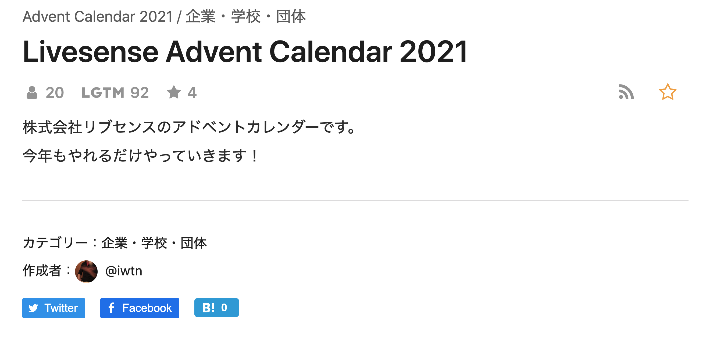
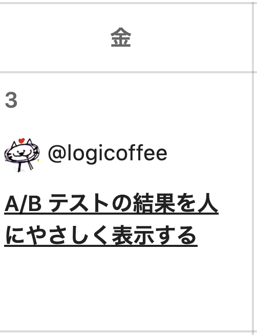
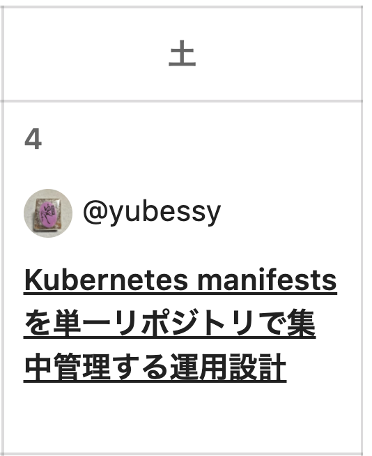
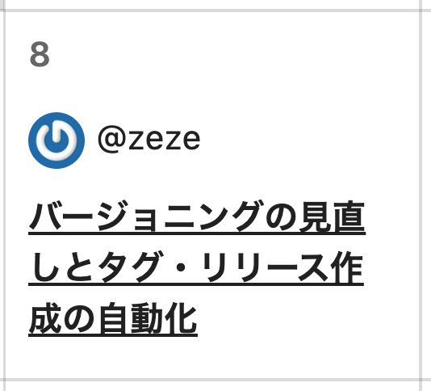
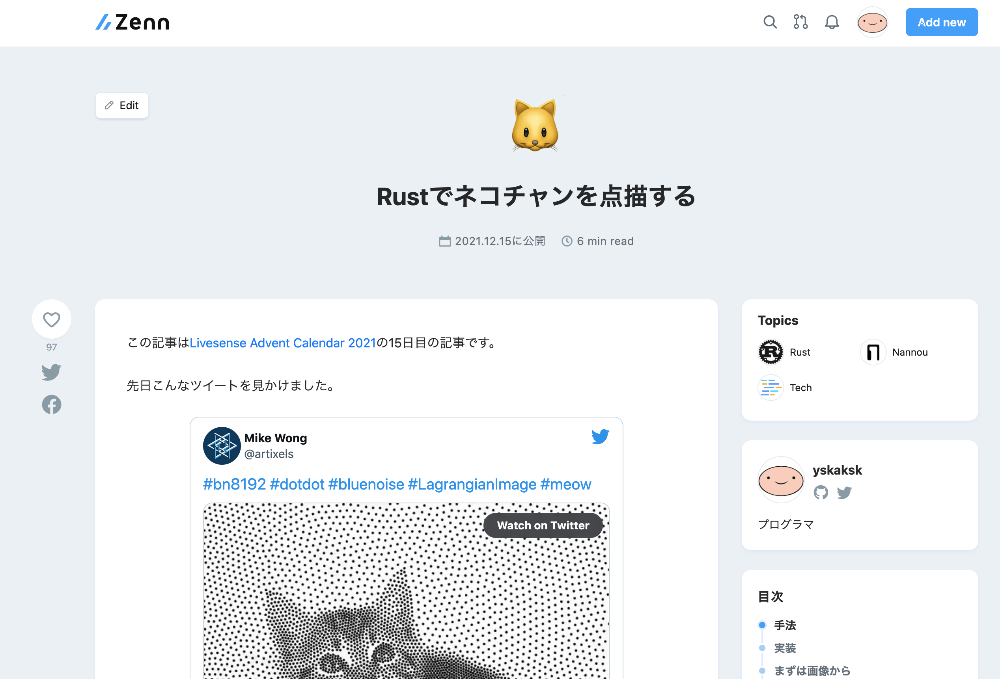
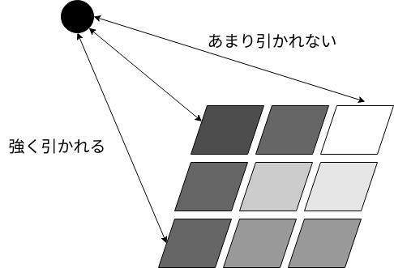
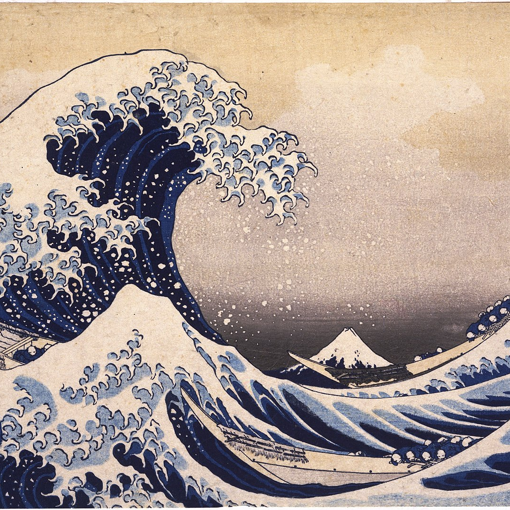
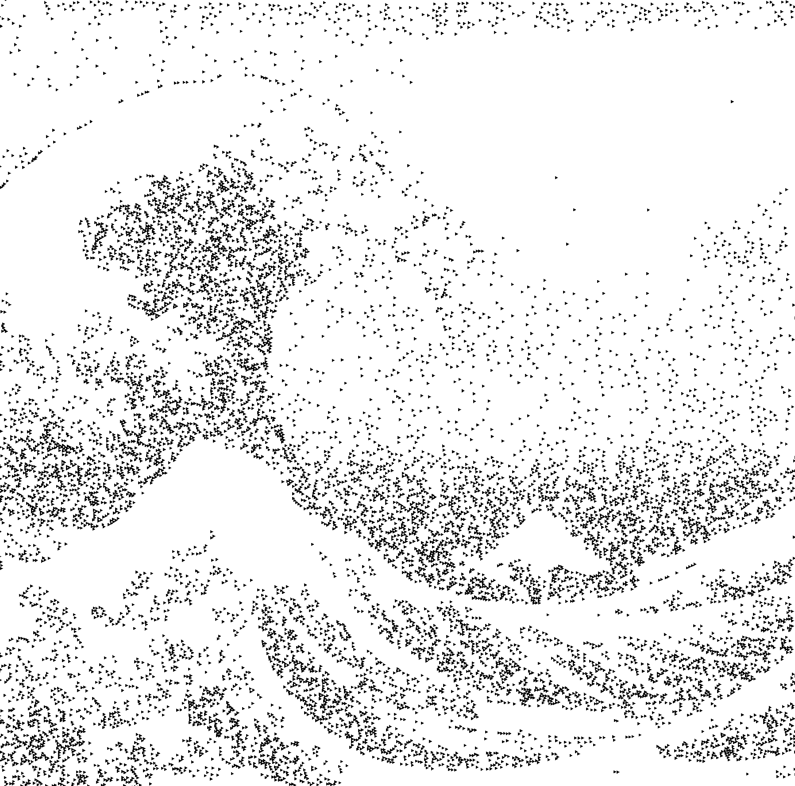
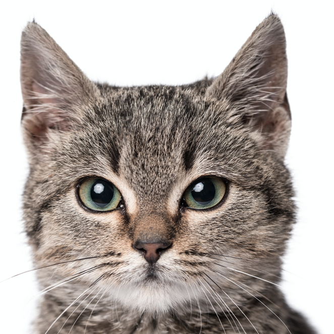
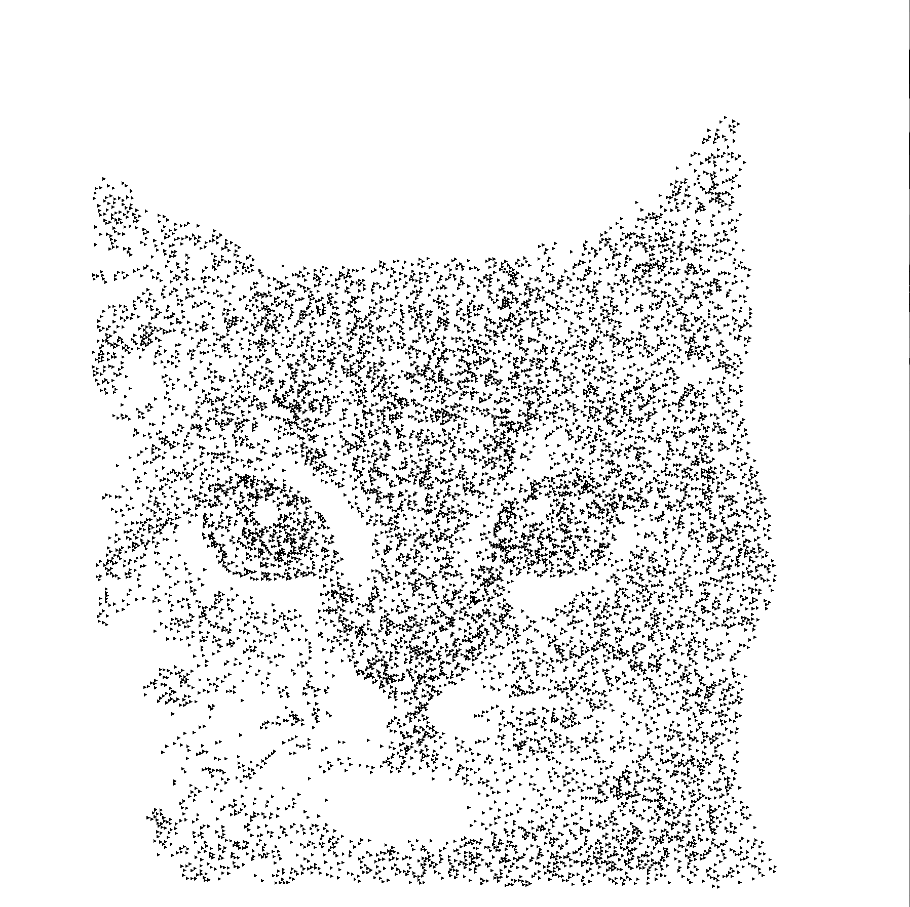

---
# try also 'default' to start simple
theme: default
# random image from a curated Unsplash collection by Anthony
# like them? see https://unsplash.com/collections/94734566/slidev
#background: https://source.unsplash.com/collection/94734566/1920x1080
background: ./picture/slide-background.jpeg
# apply any windi css classes to the current slide
class: 'text-center'
# https://sli.dev/custom/highlighters.html
highlighter: shiki
# show line numbers in code blocks
lineNumbers: false
# some information about the slides, markdown enabled
info: |
  ## Slidev Starter Template
  Presentation slides for developers.

  Learn more at [Sli.dev](https://sli.dev)
# persist drawings in exports and build
drawings:
  persist: false
---

# Rustでネコチャンを点描して、二匹目のドジョウを狙いたかった話

---

# 事の発端

* 昨年の１２月、リブセンスにてアドベントカレンダーが企画される



---

# 事の発端

* 3日に池谷さんが記事を書く




---

# 事の発端

* 4日に田中さんが記事を書く


---

# 事の発端

* そして8日には富士谷さんが記事を書く



---

# 事の発端

* 「みんな記事書いている。書いていないのお前だけ」な状態に
* 自分も何か書かなくては

---

# 事の発端

* というわけで書きました
* https://zenn.dev/yskaksk/articles/e4cd8e311cfbe4



---

# 事の発端

* 以前Twitterで見かけた点描のアルゴリズムを<strong>近似的</strong>に再現するという記事
* 意外と好評でした
    * zennのトレンド欄にもしばらく載っていた
    * はてブでも健闘
    * 公式のアカウントでも取り上げられました


<Tweet id="1471390390595244042" scale="0.4" />

---

# 事の発端

* 以上の話の教訓はなにか


---

# 事の発端

* 以上の話の教訓はなにか

<br>
<br>
<h1 style="text-align:center">「Rust」と「ネコチャン」がタイトルに入っている記事は伸びる</h1>

---

# 事の発端

* 以上の話の教訓はなにか

<br>
<br>
<h1 style="text-align:center">「Rust」と「ネコチャン」がタイトルに入っている記事は伸びる</h1>

<br>
<br>
<br>

* もう一回Rustとネコチャンで記事を書いて、二匹目のドジョウを狙うぞ！

---

# 事の発端

* 以上の話の教訓はなにか

<br>
<br>
<h1 style="text-align:center">「Rust」と「ネコチャン」がタイトルに入っている記事は伸びる</h1>

<br>
<br>
<br>

* もう一回Rustとネコチャンで記事を書いて、二匹目のドジョウを狙うぞ！
* というわけで、ネコチャンの点描の完全版をRustでやってみようと思います

---

# アルゴリズム

* そもそもどんなアルゴリズムかということを簡単に説明しましょう


---

# アルゴリズム

* 点は正の電荷を持ち、互いに反発します


---

# アルゴリズム

* 画像はグレースケールに変換され、各ピクセルはグレースケールに応じた負の電荷を持ちます



---

# アルゴリズム

* これらの力をシミュレーションすることで
    * 画像の色の濃い領域に点が集まり
    * かつ、点同士は反発するので、適度な密度が保たれる

* 点が受ける力をピクセルごとに計算する必要がある
    * zennの記事では、振る舞いを近似するために近傍だけで計算している
    * GPUを使って、すべての点、すべてのピクセルで力を計算してみよう

---

# WebGPU

* 今回はWebGPUを利用する
* WebGPUとは
* もともとWebGLというものがありました
    * JavaScript API
    * 3DCGとかができる
    * Three.jsなどで使われている
* WebGLはほぼすべてのブラウザで動作さする（と言われている）
* WebGPUはよりモダンなAPIとなるべく設計されたもの
    * https://www.w3.org/TR/webgpu/
    * WebGPU exposes an API for performing operations, such as rendering and computation, on a Graphics Processing Unit

---

# WebGPU

* WebGLとの違いは
    * compute shaderがかける
        * GPGPUがやりやすい
    * Rustの実装がある
        * mozillaが作っているもの（firefoxで使われている）
        * ちなみにGoogleが作っているC++の実装もある（chromiumで使われている）

---
layout: center
class: text-center
---

# Rustの実装がある!?

---


---
layout: center
class: text-center
---

# 「WebGPUとRustでネコチャンを点描してみた」

---
layout: center
class: text-center
---

# いける！

---
layout: center
class: text-center
---

# やっていき！

---

# 実装

* やることは二つ
    * WGSL（WebGPU Shading Language）でアルゴリズム本体を実装する
    * wgpu（WebGPUのRust実装）を使って、その他の処理を記述する

---

## WGSLでアルゴリズムを実装する

* 論文著者のリポジトリ（https://github.com/mwkm/atoMeow ）を見つつ、実装する
* そんなに難しくない

```
@stage(compute)
@workgroup_size(64)
fn main(@builtin(global_invocation_id) global_invocation_id: vec3<u32>) {
  let total = arrayLength(&particlesSrc);
  let index = global_invocation_id.x;
  if (index >= total) {
    return;
  }

  var vPos : vec2<f32> = particlesSrc[index].pos;
  var vVel : vec2<f32> = particlesSrc[index].vel;
  var vAcc : vec2<f32> = particlesSrc[index].acc;

  let Epsilon = 0.0000001;
  var acc : vec2<f32> = vec2<f32>(0.0, 0.0);

  let texture_size = textureDimensions(t);
  let texture_w = texture_size[0];
  let texture_h = texture_size[1];
...
```

---

## wgpuでその他の処理を記述する

* これは結構大変
    * GPUに渡すデータを用意する
    * GPUに渡すデータ構造を定義する
    * その他諸々の処理

---

## wgpuでその他の処理を記述する

画像データを渡す処理はこんな感じ

```rust
let texture_size = wgpu::Extent3d {
    width: img_w, height: img_h, depth_or_array_layers: 1,
};
let texture = device.create_texture(
    &wgpu::TextureDescriptor {
        size: texture_size, mip_level_count: 1, sample_count: 1,
        dimension: wgpu::TextureDimension::D2,
        format: wgpu::TextureFormat::Rgba8UnormSrgb,
        usage: wgpu::TextureUsages::TEXTURE_BINDING | wgpu::TextureUsages::COPY_DST,
        label: Some("texture")
    }
);
queue.write_texture(
    wgpu::ImageCopyTexture {
        texture: &texture,
        mip_level: 0,
        origin: wgpu::Origin3d::ZERO,
        aspect: wgpu::TextureAspect::All,
    },
    &img_rgba, // 画像データ
...
```

---

## wgpuでその他の処理を記述する

GPUに渡す点群のデータ構造を定義しているところ（の一部）

```rust
let compute_bind_group_layout = device.create_bind_group_layout(&wgpu::BindGroupLayoutDescriptor {
    entries: &[
        wgpu::BindGroupLayoutEntry {
            binding: 0,
            visibility: wgpu::ShaderStages::COMPUTE,
            ty: wgpu::BindingType::Buffer {
                ty: wgpu::BufferBindingType::Uniform,
                has_dynamic_offset: false,
                min_binding_size: wgpu::BufferSize::new(
                    (param_data.len() * mem::size_of::<f32>()) as _,
                ),
            },
            count: None,
        },
        wgpu::BindGroupLayoutEntry {
            binding: 1,
            visibility: wgpu::ShaderStages::COMPUTE,
            ty: wgpu::BindingType::Buffer {
                ty: wgpu::BufferBindingType::Storage { read_only: true },
                has_dynamic_offset: false,
                min_binding_size: wgpu::BufferSize::new((NUM_PARTICLES * 16) as _),
        ...
```

---

# 気持ち

* 参考となるドキュメントがほぼない
    * ブログでも動かしてみましたレベルの記事しか無い
    * 参考にできるのは[公式のチュートリアル](https://sotrh.github.io/learn-wgpu/)と[リポジトリ内にあるexample](https://github.com/gfx-rs/wgpu/tree/master/wgpu/examples)くらい
* あらゆる設定を調整できるようになっているが、それ故に初学者には難しい
* 大変ではあったが、「これは何だ」→コードを読んだり、ドキュメント読んだりする→「ああなるほど」というふうに一つ一つ謎を解決していくような楽しさもあった

---

# それでどうなったのか

* できたものがこちら

---


<div grid="~ cols-2 gap-16">

<div>
元の画像

</div>

<div>
点描

</div>

</div>

---

<div grid="~ cols-2 gap-16">

<div>
元の画像

</div>

<div>
点描

</div>

</div>

---
layout: center
class: text-center
---

# 微妙！

---


---


---

# 仕上がりについて

* 結構パラメタを調整したりして頑張ったが、いまひとつうまく行かない
* GPUむずかしい
* 特に猫の顔のようないろんな色を含む複雑な画像だとうまく行かない
* もとの論文（あのツイートの動画）のクオリティは驚異的
    * 実装の問題かもしれないですが

---

# GPUむずかしい

* わからんポイント
    * 当初、中央に謎の円が出現するという現象に悩まされた
        * 深夜まで悩んだ挙げ句、もういいや寝ようとおもって、寝て起きたらなおっていた
        * 「なにもしていないのになおった」
        * 再現もできず、本当に原因不明
    * また、点群が安定しているように見えても、しばらくすると一部の点が荒ぶり始める
        * 少しずつ「荒ぶり」が波及していき、収集がつかなくなる
        * 一方でこの荒ぶる点の影響を全く受けないように見える点もある。よくわからない
        * 微妙とはいえ、一応画像の再現はできているので実装が根本的に間違っているということはなさそうであるが、、、
        * データの中身を覗いてデバッグしたいが、難しい

---

# 今後

* 微妙な仕上がりが改善したら
    * 複数の画像を組み合わせたり
    * 動画を処理したり
    * Webアプリ化したりして

3匹目、4匹目のドジョウを狙っていきたい

---

# まとめ

* 知らない技術を使ってなにか作るのは楽しい
* GPUは難しい
* 今後に期待

---
layout: image
image: ./picture/neko.jpg
---


